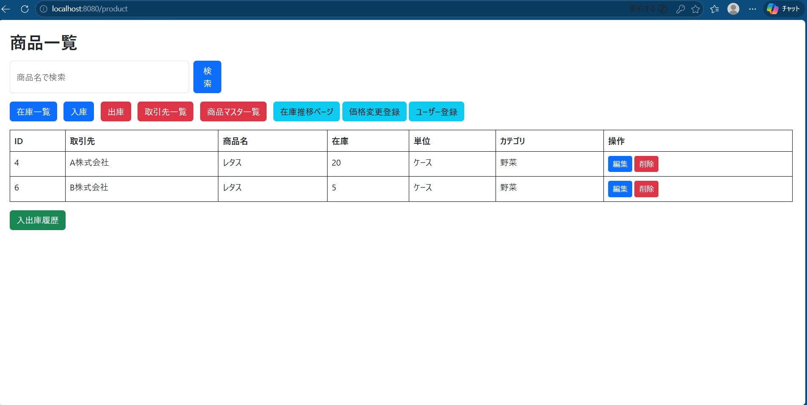
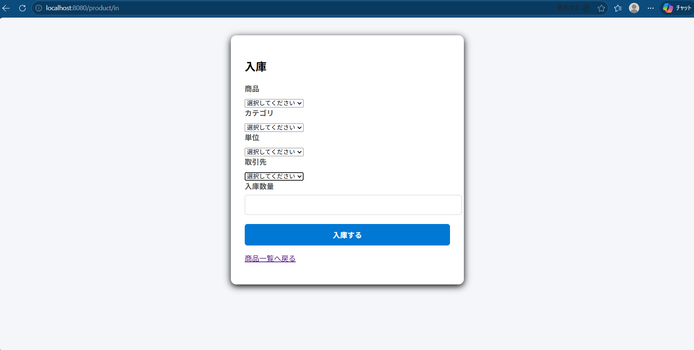
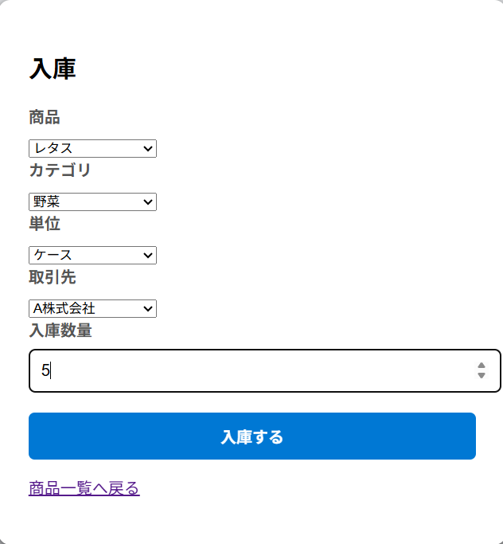
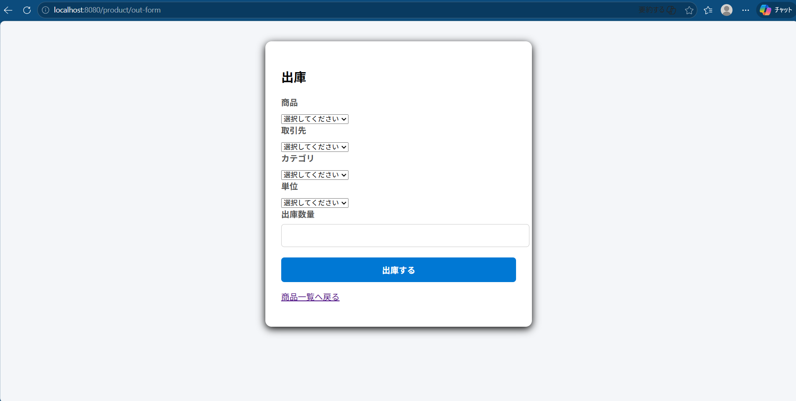
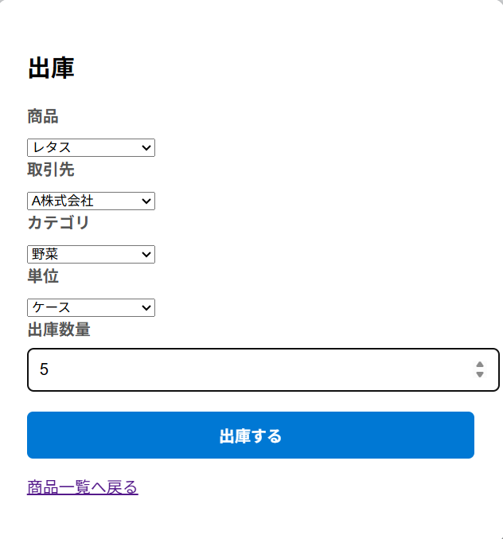
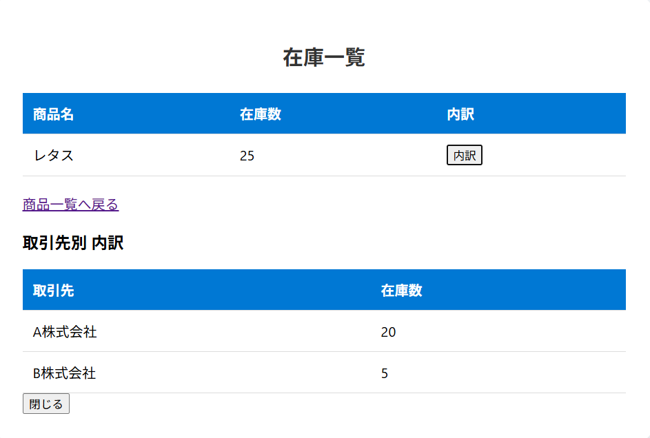
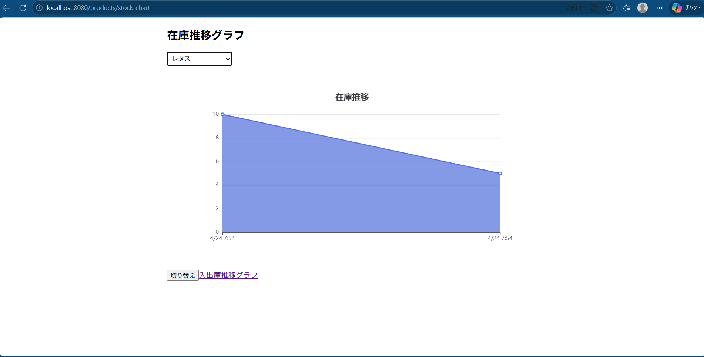
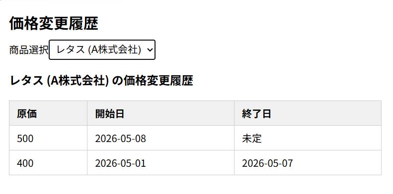
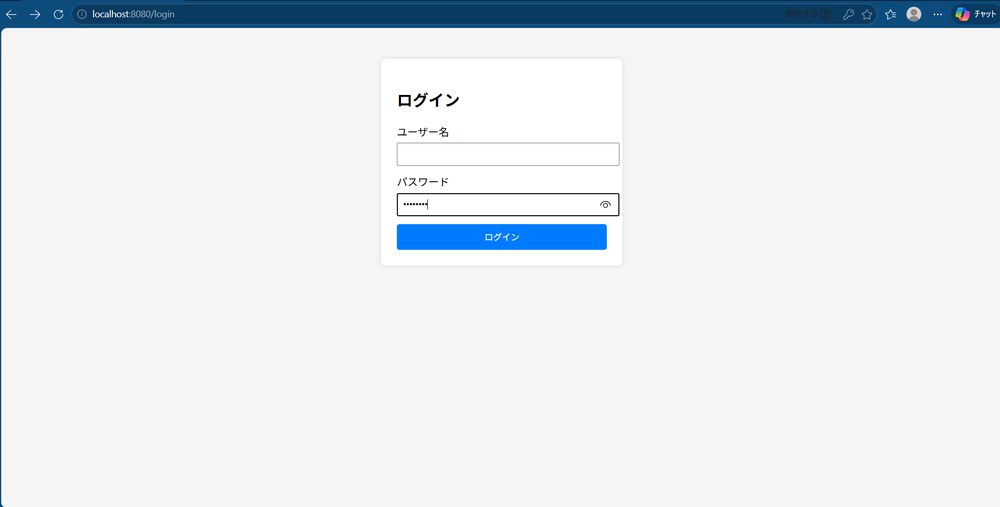
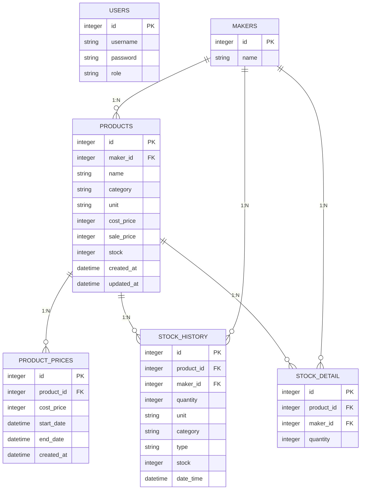

# 概要

このアプリは、在庫の入出庫管理・価格履歴管理・メーカー管理を行う業務向け在庫管理アプリです。
商品ごとに在庫履歴や価格変更履歴を記録し、在庫推移グラフによる可視化にも対応しています。
バックエンドにはSpring BootによるREST API、フロントエンドは一部画面でVue.jsを使用した構成で、Dockerによる環境構築の自動化にも対応しています。
```bash
docker compose up -d
```
の実行だけでバックエンド・フロントエンド・データベースを起動できます。


# 使用技術
## Backend
- java17
- Spring Boot3
    REST API、DI、設定管理などバックエンド全体を構築。
    Spring Securityによるログイン・認可、Spring Data JPAによるDBアクセスも担当。
- Spring Security
    ログイン認証・ユーザー権限による画面制御を実装。
- Spring Data JPA
    商品・在庫・価格履歴などの永続化処理を担当。
- MySQL8
    在庫・価格履歴・ユーザー情報などのデータ管理。
- Gradle
    ビルドツールとして使用。

## Frontend
- Thymeleaf
    基本画面のテンプレートとして使用。
    ログイン画面や商品一覧など静的ページを担当。
- Vue.js
    在庫グラフ、価格履歴、入出庫フォームなど静的UIを担当。
    API連携やリアクティブな画面更新に使用。
- Axios
    REST APIとの通信に使用。
    在庫登録、価格変更、履歴取得などの非同期処理に使用。
- Chart.js
    在庫推移グラフの描画に使用。

## Infrastructure
- Docker
    バックエンド・フロントエンド・MySQLをコンテナ化。
    docker compose up -d で環境を一括起動できる構成。
- MySQL(Dockerコンテナ)
    ローカル環境でも本番環境に近いDBを再現。
- Spring Boot(Dockerコンテナ)
    アプリケーションをコンテナとして実行可能。
- VSCode
    開発エディタとして使用。

## その他
- Git/GitHub
    バージョン管理、ブランチ運用、Pull Requestベースの開発。

# 機能一覧
## 商品管理
- 商品の登録・編集・削除ができる
    商品名、カテゴリ、メーカー、単位、価格などを管理。
    価格変更時は自動で価格履歴テーブルに記録される。

## 在庫管理（入庫・出庫）
- 入庫・出庫の登録ができる
    入出庫ごとの履歴を保存し現在庫数を自動計算。
    入庫時は数量・日付を入力、出庫時は在庫不足チェックを実施。

## 在庫一覧
- 全商品の現在庫数を一覧表示
    メーカー別内訳の表示、検索・フィルタリングに対応。
    「内訳」ボタンでメーカー別の在庫詳細をモーダル表示。

## 在庫推移グラフ
- Chart.jsを使用した在庫推移の可視化
    商品ごとの入出庫履歴をもとに、日付ごとの在庫を棒グラフで表示。

## 価格履歴管理
- 商品の価格変更履歴を自動記録
    いつ・誰が・いくらに変更したのかを一覧で確認可能。
    価格変更画面から新しい価格を登録できる。

## メーカー管理
- メーカー（取引先）の登録・編集・削除
    商品登録時にメーカーを紐付け可能。
    在庫内訳表示にも利用。

## ユーザー管理 / ログイン
- Spring Securityによるログイン認証
    ADMIN / USERのロールに応じて操作を制限。
    ADMINのみ商品登録・価格変更などが可能。

## REST API
- 商品・在庫・価格履歴・メーカー情報をAPIとして提供
    Vue.jsから利用可能。

## Dockerによる環境構築
- Docker compose up -dでバックエンド・フロントエンド・DBを一括起動。
    ローカル環境でも本番に近い構成を再現。

# 画面一覧

## 商品一覧画面
商品名・カテゴリ・メーカー・在庫数を一覧表示するメイン画面です。
在庫内訳や編集画面への画面推移が可能です。



---

## 入庫画面
商品・メーカー・数量を入力して入庫処理を行います。
入庫時にメーカー別在庫が自動作成されます。




---

## 出庫画面
商品・メーカー・数量を指定して出庫処理を行います。
在庫不足の場合はエラーを返し、安全な在庫管理を実現します。




---

## 在庫内訳画面
商品×メーカーごとの在庫数を表示します。
入庫・出庫に応じてリアルタイムに更新されます。



---

## 在庫推移グラフ
Chart.jsを使用して、商品ごとの在庫推移を可視化します。
入出庫履歴をもとに日付ごとの在庫量をグラフ表示します。



---

## 価格変更履歴画面
商品ごとの価格変更履歴を一覧表示します。
いつ・いくらに変更したかを確認できます。



---

## ログイン画面
ユーザー認証を行うログイン画面です。
ADMIN / USER のロールに応じて操作権限が変わります。



---

# 動作環境について
本アプリは開発環境（ローカル）で動作確認を行っています。
Dockerを使用してバックエンド・フロントエンド・データベースを起動する構成ですが、本番環境へのデプロイは行っていません。

# API 一覧
本アプリはSpring bootによるREST APIを使用しています。

---
## 商品API
### GET /api/products
商品一覧を取得します。

### POST /api/products
商品を新規登録します。

### PUT /api/products/{id}
商品情報を更新します。

### DELETE API　未実装
削除処理のみControllerからの実装となっておりAPI化は未対応です。
※今後の拡張としてDELETE APIを追加します。

## 価格API

### POST /api/products/{id}/price
商品価格の変更（価格履歴を自動で保存）

### GET /api/products/{id}/price-history
過去の価格履歴を取得

### 価格変更履歴の削除　API　未実装

## 在庫API
### GET /api/stock/summary
在庫サマリー一覧（商品ごとの在庫数・入庫数・出庫数）

### GET /api/stock-history/{productId}
商品ごとの在庫推移（グラフ用）

### POST /api/stock/in
入庫処理

### POST /api/stock/out
出庫処理（在庫不足時はエラー）

### 在庫履歴削除　API　未実装

## 在庫内訳API
API未実装（画面推移で表示）
本機能はAPIではなくControllerによる実装となっております。
画面専用機能のためAPI化していません。

## 履歴  API
### GET /api/stock-history/in
入庫履歴の取得

### GET /api/stock-history/out
出庫履歴の取得

## マスタ  API
### GET /api/master/categories
カテゴリを取得するAPI（固定値）

### GET /api/master/units
単位を取得するAPI（固定値）

### GET /api/master/makers
メーカー一覧取得するAPI（DBから取得）

## ユーザー　API
### POST /api/users
ユーザーの新規登録するAPI
ユーザーの重複チェック・パスワードのハッシュ化（BCrypt）
ロール付与（ADMIN・USER）

### POST /api/auth/login
ログイン処理を行います。

## 認証
本アプリの認証処理は Spring Security により実装されています。
ログイン API（/api/auth/login）は SecurityConfig にて設定されており、
実際の認証処理（ユーザー照合・パスワード検証）は
Spring Security が内部で自動的に行います。

アプリ側で実装しているのは「ユーザー登録 API（/api/users）」で、
ログイン処理そのものは独自実装していません。

## ER 図（Entity Relationship Diagram）

本アプリは、商品・在庫・価格履歴・入出庫履歴・ユーザー情報を管理するために
以下の ER 図の構造でデータを保持しています。

- PRODUCTS：商品情報
- MAKERS：メーカー情報
- PRODUCT_PRICE：価格変更履歴
- STOCK_HISTORY：入出庫履歴（IN/OUT）
- STOCK_DETAIL：在庫内訳（画面遷移で表示）
- USER：ログインユーザー情報（Spring Security）



- MAKERS と PRODUCTS は 1:N
- PRODUCTS と PRODUCT_PRICES / STOCK_HISTORY / STOCK_DETAIL は 1:N
- MAKERS と STOCK_HISTORY / STOCK_DETAIL は 1:N

# アーキテクチャ図

本アプリは、フロントエンド（Vue.js）とバックエンド（Spring Boot）、
および MySQL データベースで構成された三層アーキテクチャを採用しています。

- Vue.js：画面表示・操作、Axios による API 通信
- Controller：HTTP リクエストの受付
- Service：ビジネスロジック（在庫計算・価格履歴処理など）
- Repository：JPA による DB アクセス
- MySQL：商品・在庫・履歴データの永続化

```mermaid
flowchart LR
    subgraph Frontend[Frontend (Vue.js)]
        VUE[Vue Components]
        API[Axios API Client]
        VUE --> API
    end

    subgraph Backend[Backend (Spring Boot)]
        CONTROLLER[Controller Layer]
        SERVICE[Service Layer]
        REPOSITORY[Repository Layer]
    end

    DB[(MySQL Database)]

    API --> CONTROLLER
    CONTROLLER --> SERVICE
    SERVICE --> REPOSITORY
    REPOSITORY --> DB
```

# 工夫した点・苦労した点
## アーキテクチャの理解と責務の分離
- 最初は設計や三層アーキテクチャの理解が全くない状態からスタートしました。開発を進める中でController/Service/Repositoryの役割を学び、コードが複雑にならないように徐々に責務を分離していきました。
## 在庫計算・履歴管理
- 在庫計算や履歴管理など実務的なロジックを実装する中で多くの試行錯誤を行いました。特に入庫・出庫処理の整合性や例外処理の理解に時間がかかりましたが、デバックと調査を繰り返して実装出来ました。
## 価格変更履歴の設計と可視化
- 価格変更時の過去の価格を保持する仕組みの設計に悩みました。
  実際にはいつから・いつまで・どの価格が適用されていたかを確認できることが重要だと思い、ProductPriceテーブルを追加して履歴を残す方式に変更しました。これにより過去の価格推移を確認できるようになりました。
## Dockerによる環境構築
- Dockerを使うことで環境差異をなくす工夫をしました。
  ローカル環境ごとの差異をなくすためMySQLをDockerで統一し、「どのPCでも同じ環境で動く」状態を作りました。これにより再現性の高い開発環境を構築出来ました。
## ロールによるアクセス制御
- ロール（ADMIN/USER）によるアクセス制御の設計に悩みました。
  どのAPIを誰が使えるべきか整理し、Spring Securityの設定でアクセス制限をかけました。

# 今後の改善点
- DELETE APIの実装（商品・価格履歴・在庫履歴）
  現在はController側でのみ削除処理を行っているため、REST APIとして実装し、フロントからも削除操作ができるように改善したい。
- 在庫内訳のAPI化
  現在は画面推移で表示しているため、将来的にはAPI化しVue.jsからも取得できるようにし、UIの柔軟性を高めたい。
- 在庫推移グラフの拡張機能（期間フィルタ・月次集計）
  現状全履歴を表示しているため「期間指定」「年次・月次・週次の集計」「メーカー別比較」などより実務的な分析ができる機能を追加したい。
- 価格変更履歴の編集・削除機能
  誤登録時の修正や削除ができるようにし、価格管理の運用性を向上させたい。
- ユーザー管理機能の拡張（パスワード変更・ユーザー編集）
  現状新規登録のみのためパスワード変更・ユーザー情報編集などを追加したい。
- テストコード（JUnit）のよるロジックのテスト
  在庫計算・価格変更履歴処理などビジネスロジックが増えてきたため、単体テストを追加して保守性を高めたい。


