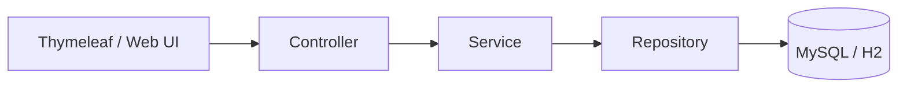

# 在庫管理アプリケーション

## 概要
このアプリケーションは、商品マスタ管理、メーカー管理、在庫入出庫管理、在庫履歴管理を一体で扱う業務向けシステムです。

主な目的は、在庫数の正確な管理と、業務上重要な整合性の担保です。具体的には、以下のような課題に対応しています。

- 商品ごとの在庫数を正確に保持する
- メーカー別の在庫を分離して管理する
- 出庫時に在庫不足やマイナス在庫を防ぐ
- 履歴と現在庫が一致していることを維持する
- 不正な入力や存在しないデータを安全に拒否する

複数の業務ルールを実装し、API・データ整合性・テストまで含めて検証しました。

---

## 技術スタック

- Java 21
- Spring Boot 3.x
- Spring MVC
- Spring Data JPA
- Spring Security
- MySQL
- H2 (テスト用)
- Thymeleaf
- Gradle
- Docker / Docker Compose
- JUnit 5
- MockMvc
- Git / GitHub

---

## 実装した機能

### 商品マスタ管理
- 商品の新規登録
- 商品の編集
- 商品の削除
- 商品名、カテゴリ、単位、在庫数、メーカー情報の管理
- メーカー必須化対応

### メーカー管理
- メーカーの登録・更新・削除
- 商品とメーカーの紐付け
- メーカー別在庫の管理基盤として設計

### 在庫管理
- 入庫処理
- 出庫処理
- 在庫数の自動更新
- 出庫時の在庫不足チェック
- 0以下や不正な数量の受け入れ拒否
- メーカー別の在庫内訳更新

### 履歴管理
- 入庫・出庫の履歴保存
- 履歴ごとに数量、種別、残在庫、メーカー、商品名を保存
- 時系列で履歴を取得可能

### 在庫サマリー
- 商品ごとの現在在庫を集計
- メーカー別の在庫状況を表示
- 履歴と現在庫の整合性を保つ

---

## 実務で意識した設計ポイント

### 1. 業務ルールをコードで明確化
単なる CRUD ではなく、以下のようなビジネスルールを実装しました。

- メーカーは必須
- 在庫が不足している場合は出庫不可
- 取引先別の在庫にも不足があれば失敗
- 0や負数の数量は受付不可
- 存在しない商品またはメーカーは拒否

### 2. 在庫の整合性を重視
在庫に関する処理では、商品テーブルの在庫とメーカー別内訳の両方を確認し、両方の整合性を保つ設計にしました。

### 3. 同時実行時の整合性を考慮
同時出庫時に在庫がマイナスになる問題を防ぐため、PESSIMISTIC_WRITE を利用したロック制御を導入しました。

### 4. 例外系に対するテストを重視
在庫不足、要求不正、存在しない ID、必須項目欠落などの異常系をテストで確認し、データが破損しないようにしました。

---

## アーキテクチャ

本アプリは、Spring Boot を中心とした 3 層構造で実装しています。

- Controller: HTTP リクエストの受付と画面制御
- Service: 業務ロジックとバリデーション
- Repository: JPA による永続化処理
- Entity: ドメインモデル
- Security: 認証・認可


```mermaid
graph LR
    UI[Thymeleaf / Web UI] --> Controller
    Controller --> Service
    Service --> Repository
    Repository --> DB[(MySQL / H2)]
```

---

## セキュリティ対応

- Spring Security による認証・認可を導入
- パスワードは BCrypt でハッシュ化して保存
- ロールベースのアクセス制御を実装
- 管理者と一般ユーザーで権限を分離

実運用を想定して以下を追加で検討する予定です。

- HTTPS 強制
- セッション/クッキーの安全設定
- ログイン失敗時の制限
- API 認証の見直し

---

## テスト戦略

### 単体テスト
- 在庫不足時の例外検証
- 商品未検出時の例外検証
- メーカー別在庫不足の検証

### 結合テスト
以下のような業務シナリオを実際のアプリケーションとして検証しました。

- 商品登録 → 入庫 → 出庫 → 履歴 → 集計の正常系
- 複数メーカーでの在庫分離
- 0、負数、在庫不足、必須項目欠落の異常系
- 存在しない商品・メーカーへの対応
- 商品削除時の整合性確認
- 同時出庫時の安全性確認

実際に以下の結合テストを含めています。

- `StockFlowIntegrationTest`
- `StockOutServiceTest`

---

## 実装上の工夫

### 1. 業務ルールをテストで担保
単に動くだけではなく、次のようなルールをテストで確認しました。

- 在庫が負になることを防ぐ
- 必須項目が欠けると処理に失敗する
- 履歴と現在庫が整合している
- リクエストが不正な場合にデータが壊れない

### 2. 変更に強い設計
業務ルールが複雑になっても、Service 層でロジックを分離しているため、更新や修正が比較的しやすい構成です。

### 3. 実装時のルール
このプロジェクトでは、単なる機能実装ではなく、以下のような実務に近い視点を意識しました。

- 重要なビジネスルールの明確化
- データ整合性の維持
- 例外処理とテスト設計
- 安全な在庫操作の実装

---

## ローカル開発環境

### 前提条件
- Java 21
- Docker / Docker Compose
- Gradle

### 起動手順

現在はローカル開発・検証用途として MySQL のみをコンテナ起動しており、アプリケーション本体は Spring Boot で直接実行して検証しています。
本番環境へのデプロイおよび本番運用構成までは未対応です。

```bash
git clone <repository-url>
cd demo3
docker compose up -d
./gradlew test
```

---

## プロジェクト構成

```text
src/
  main/
    java/
      com/example1/demo3/
        config/
        controller/
        dto/
        entity/
        exception/
        repository/
        service/
  test/
    java/
      com/example1/demo3/
        integration/
        unit/
```

---

## 今後の改善予定

- 期間別の在庫推移分析機能
- 価格履歴の編集/削除対応
- ユーザー情報更新機能の追加
- Controller 層の追加テスト拡充
- 本番向けセキュリティ強化

---

## まとめ

